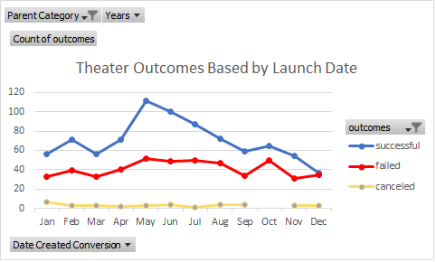
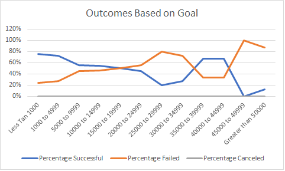

# Kickstarter Analysis with Excel

## Overview of Project

### Purpose
The motivation behind this venture is to analyze and visualize the way the different campaigns fared in relation
to their launch dates and their funding goals in the Kickstarter dataset.  This is being done to see how 
Louise's campaign for her play "Fever" compares to the overall trend in theater Kickstarter campaign.

## Analysis and Challenges

### Analysis of Outcomes Based on Launch Date
I created a pivot table from the Kickstarter dataset to visualize the campaign outcomes of successful, failed
and canceled based on the Launch date.  The following image represents a line chart based on the results of the
pivot table.

### Analysis of Outcomes Based on Goals
I also created a line graph that contains the visualization of percentage of outcomes that shows the successful,
failed and canceled plays based on the goals amount.  

### Challenges and Difficulties Encountered
One possible challenge while creating the Theater outcomes based on launch date is the fact that there was no month
option and the infomation had to be gathered from the Date Created Conversion column. 

## Results
The first conclusion that I draw on Theater Outcomes based on Launch Date is that the month of May was the most successful. 
The second conclusion is that after the month of May, the number of successful campaigns declined steadily through the month
of September.

I can conclude for Outcomes Based on Goals was that there was no canceled plays.

The imitations of this data set is the sample size of which the plays were pulled from and the time frame that it covered.

Another chart that I can create is Theater Outcomes Based on the Launch Year.

